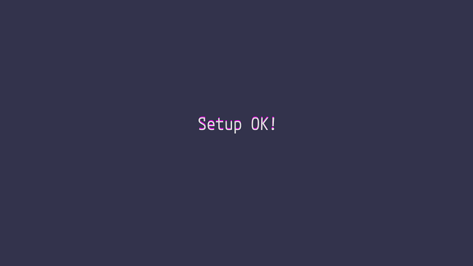

# textalive-app-babylonjs-text-sample
本リポジトリは Babylon.js および TextAlive App API を用いてミュージックビデオに合わせて歌詞の 3D オブジェクトを表示するサンプルアプリです。</br>


## サンプルアプリの概要
- アプリを起動し画面に「Setup OK!」と表示されたら、画面を押すことで曲が再生されます。</br>

- 曲の再生に合わせてフレーズ単位で歌詞が画面中央に 3D オブジェクトとして表示されます。</br>
- マウスやタップで画面をドラッグすることで歌詞周囲を回るよう視点変更します。</br>


## セットアップ方法
### 前準備
[Node.js](https://nodejs.org/) をインストールして下さい。</br>
コマンドプロンプトや端末などで ```npm``` のコマンドを実行できればOKです。</br> 

### パッケージのインストール
package.json のあるディレクトリにて下記コマンドを実行し、パッケージをインストールして下さい。</br>
```
npm install
```

### TextAlive App API トークンの設定
トークンを https://developer.textalive.jp/ から取得して下さい。</br>
```Player``` を生成時の引数で ```"your token”``` と書かれている箇所に設定して下さい。</br>

```Player``` の生成は ```src/SampleSequence.ts``` 内 ```TextAliveAppAPISampleSequence.initialize()``` で行っていますので、該当の箇所を書き換えてアプリを動作させて下さい。</br>
```
this._textalivePlayer = new Player({
    app: {
        token: "your token"
    },
    valenceArousalEnabled: true,
    vocalAmplitudeEnabled: true,
    mediaElement: document.querySelector<HTMLElement>("#media"),
});
```

### サーバの起動
下記コマンドを実行することで、サーバが起動します。</br>
```
npm run build-dev
```

下記の出力が表示されていれば OK です。</br>
その URL にアクセスすることでアプリを確認することができます。</br>
> Server running at `http://localhost:****` (**** はデフォルト 1234 のポート番号)


## ソースコード概要
### index.ts
アプリ起動時のエントリーポイント。</br>

### BabylonjsText3DSample.ts
- class BabylonjsText3DSample
  - Babylonjs にて 3D シーンを構成、テキスト表示するための機能をまとめたクラス。</br>

### SampleSequence.ts
- class BabylonjsText3DSampleSequence
  - BabylonjsText3DSample を生成し、準備が完了したらテキストを表示するクラス。</br>
- class TextAliveAppAPISampleSequence
  - BabylonjsText3DSampleSequence に TextAlive App API を使用し、楽曲再生に合わせた歌詞表示機能を実装したクラス。</br>


## Tips
### 再生楽曲の変更方法
```TextAliveAppAPISampleSequence.onAppReady()``` で読み込む楽曲地図（ビート、コード、歌詞タイミング etc.）の設定を行っていますので、その箇所を書き換えることで別の楽曲でもアプリを再生することができます。</br>

```PlayerVideoOptions``` は特定バージョンの音楽地図を読み込む際に指定します。指定しない場合、最新の音楽地図の設定が読み込まれます。</br>

ソースコードでは「Loading Memories / せきこみごはん feat. 初音ミク」の音楽地図を読み込む設定になっています。</br>
```
const musicUrl = "https://piapro.jp/t/RoPB/20220122172830";
const options: PlayerVideoOptions = {
    video: {
        // 音楽地図訂正履歴: https://songle.jp/songs/2243651/history
        beatId: 4086301,
        chordId: 2221797,
        repetitiveSegmentId: 2247682,
        // 歌詞タイミング訂正履歴: https://textalive.jp/lyrics/piapro.jp%2Ft%2FRoPB%2F20220122172830
        lyricId: 53718,
        lyricDiffId: 7076,
    }
};
this._textalivePlayer.createFromSongUrl(musicUrl, options);
```

### 3D Text の生成時パラメータ
```MeshBuilder.CreateText()``` にてテキストを生成する際、オプションプロパティにてテキストの形状やマテリアル関連の設定ができます。</br>

参考資料：公式リファレンス</br>
https://doc.babylonjs.com/features/featuresDeepDive/mesh/creation/set/text</br>

下記は ```BabylonjsText3DSample.Disp3DText()``` のテキスト生成処理にオプションプロパティの説明コメントを追加したものになります。</br>
```
this._textMesh = MeshBuilder.CreateText("SampleText", text, this._fontData,
{
    size: 4, // テキストのサイズ
    resolution: 8, // 曲線の滑らかさ
    depth: 1, // テキストの奥行幅

    // 1文字ごとの配色設定
    // @param index テキストにおいて何バイト目（何文字目）開始の文字か
    perLetterFaceColors: (index: number) => {
        return [
            new Color4(1, 1, 1, 1), // 前面の色
            new Color4(1, 0, 1, 1), // 側面の色
            new Color4(1, 1, 1, 1)  // 背面の色
        ];
    }
}, this._scene, earcut);
```
```perLetterFaceColors: (index: number)``` は1文字ごとにテキストの色を設定できる関数です。</br>
```index``` はテキストにおいて何バイト目（何文字目）開始の文字かを示しており、例えばグラデーションをかけたい場合などに活用できます。</br>

「何バイト目（何文字目）開始の文字か」と書いていますが、これは日本語のようなマルチバイト文字の場合「index == 何文字目」が成立しない為です。</br>
マルチバイト文字テキストのバイト数（文字数）を取得するには、```TextEncoder.encode(text).length``` などを用いるよう注意しましょう。</br>

### フォントデータの作成、変更方法
ttf ファイルを Facetype.js にて json に変換することで、3D Text 生成の為のフォントファイルを生成できます。</br>

https://gero3.github.io/facetype.js/

生成したフォントの json ファイルは ```assets/fonts``` 以下に配置して下さい。</br>

```BabylonjsText3DSample.constructor()``` でフォントの json ファイルを読み込んでいますので、その個所を書き換えることで別のフォントを使用できます。</br>

参考資料：公式リファレンス</br>
https://doc.babylonjs.com/features/featuresDeepDive/mesh/creation/set/text</br>

### 特定文字のみのフォントデータ差し替え方法
フォントの json ファイル内 "glyphs" 以下に文字の形状データが入っているので、それを変更することで差し替え可能です。</br>
```
{
    "glyphs": {
        "0": { "0" の形状データ },
        "1": { "1" の形状データ },
    ...
        "*": { "*" の形状データ },
    ...
}
```


## License
### package
- babylonjs</br>
  Apache License 2.0 http://www.apache.org/licenses/LICENSE-2.0</br>
  https://github.com/BabylonJS/Babylon.js/blob/master/license.md</br>
- earcut</br>
  Copyright (c) 2016, Mapbox
  https://github.com/mapbox/earcut/blob/main/LICENSE</br>
- textalive-app-api</br>
  https://github.com/TextAliveJp/textalive-app-api/blob/master/LICENSE.md</br>
- buffer</br>
  Copyright (c) Feross Aboukhadijeh, and other contributors.</br>
  https://github.com/feross/buffer/blob/master/LICENSE</br>
- copy-files-from-to</br>
  Copyright (c) 2017 webextensions.org</br>
  https://github.com/webextensions/copy-files-from-to/blob/master/LICENSE</br>
- del-cli</br>
  Copyright (c) Sindre Sorhus <sindresorhus@gmail.com> (https://sindresorhus.com)</br>
  https://github.com/sindresorhus/del-cli/blob/main/license</br>
- parcel</br>
  Copyright (c) 2017-present Devon Govett</br>
  https://github.com/parcel-bundler/parcel/blob/v2/LICENSE</br>
- process</br>
  Copyright (c) 2013 Roman Shtylman <shtylman@gmail.com></br>
  https://github.com/defunctzombie/node-process/blob/master/LICENSE</br>
- typescript</br>
  Apache License 2.0 http://www.apache.org/licenses/LICENSE-2.0</br>
  https://github.com/microsoft/TypeScript/blob/main/LICENSE.txt</br>

### Font
- Mplus 1 Code</br>
  Copyright 2021 The M+ FONTS Project Authors</br>
  https://github.com/coz-m/MPLUS_FONTS</br>
- 自家製 Rounded M+</br>
  自家製フォント工房</br>
  http://jikasei.me/font/rounded-mplus/about.html</br>
